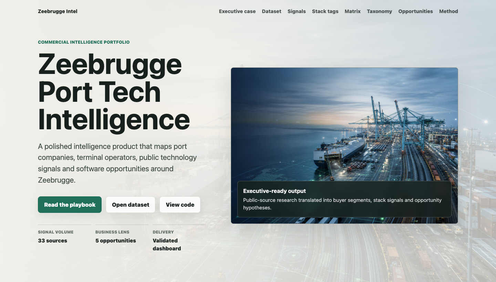
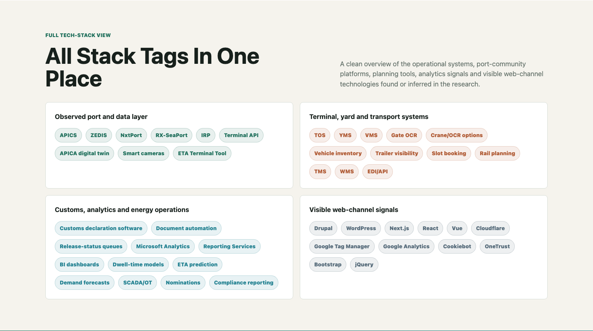
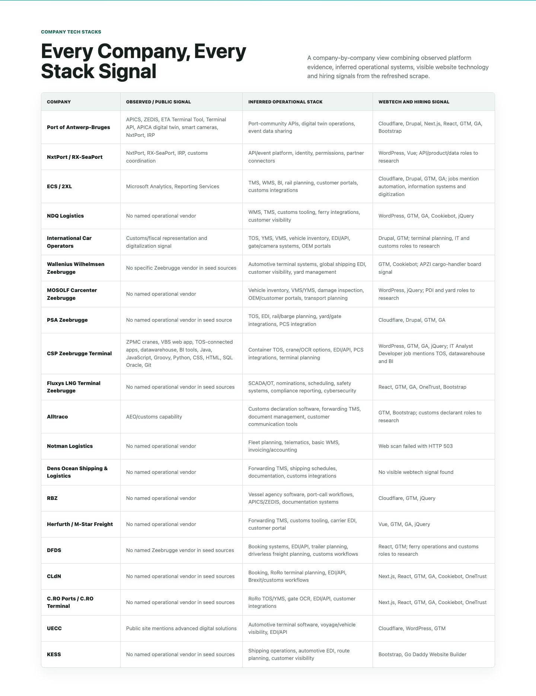
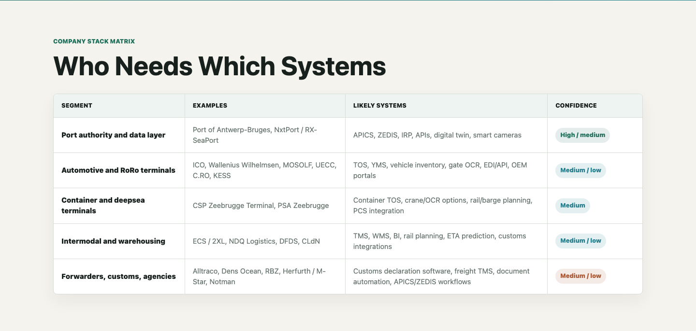
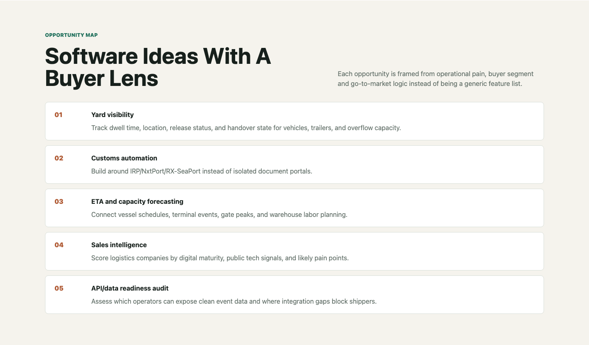

# Zeebrugge Port Tech Intelligence

An executive-ready intelligence repo that turns public Zeebrugge port-logistics signals into structured datasets, technology-stack hypotheses, scraped source evidence and commercial software opportunities.

[](https://github.com/KippieG/zeebrugge-logistics-intel/actions/workflows/validate.yml)
[](https://github.com/KippieG/zeebrugge-logistics-intel/actions/workflows/pages.yml)


**Live dashboard:** https://kippieg.github.io/zeebrugge-logistics-intel/  
**Snapshot date:** 2026-06-03  
**Scope:** Zeebrugge-focused logistics ecosystem, with Port of Antwerp-Bruges context  
**What this is:** market intelligence, data modeling, source scraping, tech-stack inference and commercial opportunity mapping in one portfolio project

## Project Labels


## Repository Tech Stack Labels

These badges are specific to this repo: they cover the implementation stack, validation workflow, scraped logistics technology signals and observed company/vendor stack evidence.

### Build, Data And Automation


### Dashboard, QA And Delivery


### Observed Port And Terminal Stack


### Inferred Operational Stack Families


### Observed Company Engineering Signals


### Observed Webtech Signals


## What I Built

- Expanded the evidence base to **45 public sources**, including Firecrawl-discovered port, route, vacancy, terminal-operation and TOS vendor pages.
- Modeled **13 structured datasets** with source IDs, confidence labels, Firecrawl targets, vendor research and automated validation.
- Translated public signals into **5 commercial software opportunities** for logistics-tech buyers.

## The Short Version

Zeebrugge is a dense logistics gateway with automotive/RoRo, UK-Ireland shortsea, container handling, intermodal warehousing, customs workflows and LNG/energy logistics. That mix creates recurring operational pain around visibility, release status, yard coordination, document flow and data interoperability.

This repo maps that ecosystem from public sources and turns it into:

- a polished GitHub Pages intelligence dashboard
- 20 seed companies and platforms
- 45 registered public sources
- 45 scraped text extracts
- 13 structured CSV datasets
- 13 Firecrawl-ready crawl/scrape targets
- 11 Firecrawl evidence rows from successful search+scrape runs
- 11 vendor stack research rows
- 6 port-logistics technology layers
- 5 commercial software opportunity areas
- validation scripts, CI checks and Playwright visual smoke tests

The result is not just a list of companies. It is a repeatable research system that shows how public information can become a useful commercial view of a logistics market.

## Why This Repo Stands Out

This project is built to show end-to-end ownership, not only research.

| Capability | What the repo proves |
| --- | --- |
| Market research | Finds useful signals in port, terminal, APZI, company, job, registry and platform sources. |
| Data engineering | Normalizes findings into CSV datasets with source IDs, confidence labels, company stack rows and validation rules. |
| Scraping | Captures text extracts from seed URLs, records Firecrawl evidence and keeps scraped outputs available for review. |
| Tech-stack analysis | Separates observed platform signals from inferred operational systems such as TOS, YMS, WMS, TMS, EDI and APIs. |
| Commercial thinking | Converts findings into buyer segments, pain signals, product angles and go-to-market notes. |
| Delivery quality | Ships a dashboard, README, reports, scripts, CI validation and visual smoke tests. |

For a recruiter, this shows practical execution.  
For a manager, it shows judgment and communication.  
For a commercial team, it shows how research can point toward real software opportunities.

## Key Findings

### 1. The strongest technology signals are ecosystem-level

The clearest verified stack signals sit around the port-community and data-sharing layer:

- **Navis N4 / Kaleris N4** for CSP Zeebrugge Terminal TOS, now backed by public deployment evidence
- **APICS** for port/vessel operational information
- **ZEDIS** as a Zeebrugge port-community system signal
- **NxtPort / RX-SeaPort** for data sharing and customs-related coordination
- **IRP** for import release and customs digitization across Belgian ports
- **APICA digital twin**, smart cameras, ETA tooling and terminal APIs from Port of Antwerp-Bruges

This matters because software vendors should not treat each company as an isolated island. The commercial opportunity is often about integrating with the port data layer, not replacing it.

### 2. Company-level operational stacks are mostly hidden

Most terminals, forwarders and logistics operators do not publicly name their operational software vendors. The repo therefore avoids overclaiming.

Instead, each company is scored using:

- `observed`: a public source names the system, platform, product or vendor
- `inferred`: the operational stack is likely from the business activity, but no vendor is named
- `unknown`: no reliable public signal was found

Example: ECS / 2XL has an observed Microsoft Analytics / Reporting Services signal. Many other operators likely use TOS, YMS, WMS, TMS, EDI, gate tooling or customs systems, but those are marked as inferred unless the source evidence is explicit.

### 3. Zeebrugge has strong software pain around visibility and customs

The repeated operational themes are:

- vehicle, trailer and container dwell time
- yard location and handover status
- customs release and missing-document workflows
- UK/Ireland shortsea complexity
- terminal gate coordination
- rail, warehouse and labor planning
- API/data readiness for shippers and partners

That makes Zeebrugge a useful research beachhead for logistics-tech vendors, because the same structure can be reused for Antwerp, Rotterdam, Hamburg, Dunkirk or other North Sea logistics clusters.

### 4. Webtech scans are useful, but not enough

The lightweight scanner found visible web-channel signals such as Drupal, WordPress, Next.js, React, Cloudflare, Google Tag Manager, Cookiebot and OneTrust.

These are not proof of operational systems. They are useful digital-maturity signals, but they must be combined with job postings, vendor cases, registry data, interviews and platform evidence before being used commercially.

### 5. APZI confirms ecosystem density, but not a clean full export

Public APZI pages confirm a broader Zeebrugge port-company ecosystem and expose categories, board/segment representation and visible member-page candidates. A complete member database still needs direct APZI/Voka access, browser/API extraction or another official export.

## Dataset At A Glance

| Area | Count | File |
| --- | ---: | --- |
| Seed companies and platforms | 20 | [`data/companies.csv`](data/companies.csv) |
| Public source register | 45 | [`data/sources.csv`](data/sources.csv) |
| Scraped source extracts | 45 | [`data/scraped/`](data/scraped) |
| Port-logistics stack layers | 6 | [`data/stack_taxonomy.csv`](data/stack_taxonomy.csv) |
| Product opportunities | 5 | [`data/opportunities.csv`](data/opportunities.csv) |
| Company enrichment rows | 20 | [`data/company_enrichment.csv`](data/company_enrichment.csv) |
| APZI board/segment signals | 17 | [`data/apzi_board_signals.csv`](data/apzi_board_signals.csv) |
| APZI public-page candidates | 22 | [`data/apzi_member_candidates.csv`](data/apzi_member_candidates.csv) |
| Webtech scan rows | 20 | [`data/web_tech_scan.csv`](data/web_tech_scan.csv) |
| Company-by-company stack rows | 20 | [`data/company_stack_signals.csv`](data/company_stack_signals.csv) |
| Firecrawl scrape/crawl targets | 13 | [`data/firecrawl_targets.csv`](data/firecrawl_targets.csv) |
| Firecrawl evidence rows | 11 | [`data/firecrawl_evidence.csv`](data/firecrawl_evidence.csv) |
| Vendor stack research rows | 11 | [`data/tech_stack_vendor_research.csv`](data/tech_stack_vendor_research.csv) |

## What Was Scraped And Modeled

The source register and scraper focus on public evidence that can support business analysis:

- Port of Antwerp-Bruges digital product pages and port facts
- APICS, ZEDIS, NxtPort, RX-SeaPort and IRP-related sources
- RoRo, deepsea, container, customs, forwarding and warehousing company pages
- APZI public pages and board/member signals
- company contact, VAT/registry and hiring signals where public snippets expose them
- Firecrawl-discovered ETA Terminal Tool, IRP, Maritime Logistics Zone, ECS vacancy, UECC terminal and RoRo route-network pages
- Navis N4 / Kaleris TOS deployment, product and security context for terminal stack research
- webtech headers, generators, scripts and visible website metadata

Scraped extracts are stored in [`data/scraped/`](data/scraped), so the dataset is reviewable instead of being a black box.

## Company And Stack Map

The company dataset maps operators into practical segments:

| Segment | Example companies/platforms | Likely stack themes |
| --- | --- | --- |
| Port authority and data layer | Port of Antwerp-Bruges, NxtPort / RX-SeaPort | APICS, ZEDIS, IRP, APIs, digital twin, smart cameras |
| Automotive and RoRo | ICO, Wallenius Wilhelmsen, MOSOLF, UECC, C.RO, KESS | TOS, YMS, vehicle inventory, gate OCR, OEM/customer portals |
| Container and deepsea terminals | CSP Zeebrugge Terminal, PSA Zeebrugge | Container TOS, crane/OCR options, EDI/API, rail/barge planning |
| Intermodal and warehousing | ECS / 2XL, NDQ Logistics, DFDS, CLdN | TMS, WMS, BI, rail planning, customs integration, ETA prediction |
| Forwarders, customs and agencies | Alltraco, Dens Ocean, RBZ, Herfurth / M-Star, Notman | Customs declaration software, freight TMS, document automation, APICS/ZEDIS workflows |
| Energy logistics | Fluxys LNG Terminal Zeebrugge | SCADA/OT, nominations, scheduling, safety systems, compliance reporting |

## Tech Stack Vendor Map

This is the sharper vendor-level view: what is publicly observed, what is category evidence, and what should still be verified through jobs, vendor cases, interviews or procurement signals.

| Stack family | Vendor / product | Evidence status | Where it matters |
| --- | --- | --- | --- |
| Terminal Operating System | **Navis N4 / Kaleris N4** | Observed public evidence | CSP Zeebrugge Terminal |
| Terminal optimization | Expert Decking / PrimeRoute | Observed in Navis N4 deployment article | CSP yard strategy and route/resource optimization |
| Port community systems | APICS, ZEDIS, NxtPort, RX-SeaPort, IRP | Observed public evidence | Port authority, terminals, agents, customs and forwarders |
| Customs / forwarding | CargoWise, Descartes, customs declaration platforms | Research target | Forwarders, customs brokers and shipping agents |
| Transport management | TMS, route planning, ferry booking, trailer planning | Inferred vendor family | DFDS, CLdN, ECS, NDQ and shortsea/intermodal flows |
| Warehouse management | WMS, automated warehouse systems, MS SQL BI | Mixed evidence | ECS and warehouse-heavy operators |
| Automotive terminal management | VDTMS, vehicle inventory, track-and-trace | Mixed evidence | UECC observed; ICO, MOSOLF, Wallenius, C.RO and KESS to verify |
| Enterprise engineering | .NET, Angular, C#, MS SQL Server, Azure, Docker, Kubernetes | Observed public evidence | ECS in-house logistics applications |
| ERP / finance | SAP, Oracle, Microsoft Dynamics | Research target | Larger terminals and logistics operators |

The important upgrade is CSP: `Navis N4` is no longer just a plausible terminal-system family. It is now an observed public stack signal in this repo.

### Tech Stack Labels


## Company Tech Stack Signals

This section is the practical per-company view: what is observed, what is inferred from the operating model, what the latest webtech scan found, and which hiring/job snippets reveal operational or IT priorities.

| Company | Observed / public stack signal | Inferred operational stack | Webtech / vacancy signal |
| --- | --- | --- | --- |
| Port of Antwerp-Bruges | APICS, ZEDIS, ETA Terminal Tool, Terminal API, APICA digital twin, smart cameras, NxtPort, IRP ecosystem | Port-community APIs, digital twin operations, event data sharing | Cloudflare, Drupal, Next.js, React, GTM, GA, Bootstrap; digital-port roles to research |
| NxtPort / RX-SeaPort | NxtPort, RX-SeaPort, IRP, customs coordination | API/event platform, identity and permissions, partner connectors | WordPress, Vue; API/product/data/customs integration roles to research |
| ECS / 2XL | Microsoft Analytics, Reporting Services, in-house apps, customer/supplier interfaces, .NET, Angular, C#, MS SQL Server, Azure, Docker, Kubernetes | TMS, WMS, BI, rail planning, customer portals, customs integrations | Official software vacancy confirms a modern Microsoft/cloud engineering stack plus event-driven and domain-driven architecture signals |
| NDQ Logistics | No named operational vendor | WMS, TMS, customs tooling, ferry integrations, customer visibility | WordPress, GTM, GA, Cookiebot, jQuery; Brexit/customs/planner/warehouse roles to research |
| International Car Operators | Customs/fiscal representation, digitalization and innovation signal | TOS, YMS, VMS, vehicle inventory, EDI/API, gate/camera systems, OEM portals | Drupal, GTM; terminal planning, IT, vehicle processing, customs and operations roles to research |
| Wallenius Wilhelmsen Zeebrugge | No specific Zeebrugge vendor in seed sources | Automotive terminal systems, global shipping EDI, customer visibility, yard management | GTM, Cookiebot; APZI cargo-handler board signal |
| MOSOLF Carcenter Zeebrugge | No named operational vendor | Vehicle inventory, VMS/YMS, damage inspection, OEM/customer portals, transport planning | WordPress, jQuery; PDI, yard, operations, IT and customer service roles to research |
| PSA Zeebrugge | No named operational vendor in seed source | TOS, EDI, rail/barge planning, yard/gate integrations, PCS integration | Cloudflare, Drupal, GTM, GA; terminal planning, gate, operations and IT roles to research |
| CSP Zeebrugge Terminal | Navis N4 / Kaleris N4 TOS, Expert Decking, PrimeRoute, ZPMC cranes, VBS web app, TOS-connected internal apps, datawarehouse, BI tools, Java, JavaScript, Groovy, Python, CSS, HTML, SQL Oracle, Git | Container TOS, crane/OCR options, EDI/API, PCS integrations, terminal planning | WordPress, GTM, GA, jQuery; Navis N4 deployment evidence plus IT Analyst Developer signal |
| Fluxys LNG Terminal Zeebrugge | No named operational vendor in seed sources | SCADA/OT, nominations, scheduling, safety systems, compliance reporting, cybersecurity | React, GTM, GA, OneTrust, Bootstrap; OT/process control/HSE/cybersecurity roles to research |
| Alltraco | AEO/customs capability | Customs declaration software, forwarding TMS, document management, customer communication tools | GTM, Bootstrap; customs declarant, freight forwarder and operations roles to research |
| Notman Logistics | No named operational vendor | Fleet planning, telematics, basic WMS, invoicing/accounting | Web scan failed with HTTP 503; planner, dispatcher, warehouse and fleet roles to research |
| Dens Ocean Shipping & Logistics | No named operational vendor | Forwarding TMS, shipping schedules, documentation, customs integrations | No visible webtech signal found; shipping/forwarding/customer-service roles to research |
| RBZ | No named operational vendor | Vessel agency software, port-call workflows, APICS/ZEDIS interaction, documentation systems | Cloudflare, GTM, jQuery; shipping agent, vessel operations and documentation roles to research |
| Herfurth Logistics / M-Star Freight | No named operational vendor | Forwarding TMS, customs tooling, carrier EDI, customer portal | Vue, GTM, GA, jQuery; freight forwarder, customs, IT and EDI roles to research |
| DFDS | Zeebrugge freight route evidence, no named operational vendor | Booking systems, EDI/API, trailer planning, driverless freight planning, customs workflows | React, GTM; Firecrawl confirms Zeebrugge-Gothenburg, Zeebrugge-Fredrikstad and Zeebrugge-Immingham route context |
| CLdN | Zeebrugge route network and CLdN RoRo platform evidence | Booking, RoRo terminal planning, EDI/API, Brexit/customs workflows | Next.js, React, GTM, GA, Cookiebot, OneTrust; Firecrawl confirms CLdN/DFDS route expansion and Routescanner network evidence |
| C.RO Ports / C.RO Terminal | Routescanner lists C.RO Ports Zeebrugge terminal connections | RoRo TOS/YMS, gate OCR, EDI/API, customer integrations | Next.js, React, GTM, GA, Cookiebot, OneTrust; terminal-network evidence around Albert II Dock and Brittanniadok |
| UECC | Technology-driven terminal operations, real-time tracking, web-based tracking, OEM/customer IT integration, VDTMS | Automotive terminal software, voyage/vehicle visibility, EDI/API with OEMs and ports | Cloudflare, WordPress, GTM; one of the strongest observed automotive terminal-management signals |
| KESS | No named operational vendor in seed sources | Shipping operations, automotive EDI, route planning, customer visibility | Bootstrap, Go Daddy Website Builder; shipping operations, planner and customer service roles to research |

## Firecrawl Expansion Layer

The project now includes a Firecrawl-backed research layer instead of only a dependency-free seed scraper.

| Firecrawl output | What it adds |
| --- | --- |
| [`data/firecrawl_evidence.csv`](data/firecrawl_evidence.csv) | Successful Firecrawl search+scrape findings for ETA Terminal Tool, IRP, Maritime Logistics Zone, ECS software vacancy, CLdN/DFDS routes, DFDS schedules, UECC terminal operations, Routescanner CLdN network data and Navis N4/Kaleris TOS evidence. |
| [`data/firecrawl_targets.csv`](data/firecrawl_targets.csv) | A reproducible target list for future Firecrawl scrape/crawl runs, with scope, limit, depth and source references. |
| [`scripts/firecrawl_collect.py`](scripts/firecrawl_collect.py) | A small CLI wrapper that runs `firecrawl scrape` or `firecrawl crawl` from the target list and writes outputs to `data/firecrawl/`. |

The strongest company-specific tech-stack signals are now CSP and ECS. CSP has public Navis N4 / Kaleris N4 TOS deployment evidence. ECS has an official software-developer vacancy that names in-house applications, customer/supplier interfaces, `.NET`, `Angular`, `C#`, `MS SQL Server`, `TSQL`, `ASP.NET Core`, `Azure`, `Docker`, `Kubernetes`, event-driven architecture and domain-driven design. UECC also exposes unusually clear terminal-system evidence: real-time tracking, web-based tracking, OEM/customer IT integration and a Vehicle Distribution and Terminal Management System.

## Complete Tech Stack Tag View

The repo separates operational technology, ecosystem platforms and visible web-channel signals. This keeps the analysis useful without pretending that a public website stack proves the back-office or terminal stack.

| Layer | Tags |
| --- | --- |
| Observed port and data layer | `APICS`, `ZEDIS`, `NxtPort`, `RX-SeaPort`, `IRP`, `Terminal API`, `APICA digital twin`, `smart cameras`, `ETA Terminal Tool` |
| Terminal, yard and transport systems | `Navis N4`, `Kaleris N4`, `TOS`, `YMS`, `VMS`, `Expert Decking`, `PrimeRoute`, `gate OCR`, `crane/OCR options`, `vehicle inventory`, `trailer visibility`, `slot booking`, `rail planning`, `TMS`, `WMS`, `EDI/API` |
| Customs, analytics and energy operations | `customs declaration software`, `document automation`, `release-status queues`, `Microsoft Analytics`, `Reporting Services`, `BI dashboards`, `dwell-time models`, `ETA prediction`, `demand forecasts`, `SCADA/OT`, `nominations`, `compliance reporting` |
| Company engineering and terminal-management signals | `.NET`, `Angular`, `C#`, `MS SQL Server`, `TSQL`, `ASP.NET Core`, `Azure`, `Docker`, `Kubernetes`, `event-driven architecture`, `domain-driven design`, `VDTMS`, `track-and-trace`, `web-based tracking`, `OEM IT integration` |
| Visible web-channel signals | `Drupal`, `WordPress`, `Next.js`, `React`, `Vue`, `Cloudflare`, `Google Tag Manager`, `Google Analytics`, `Cookiebot`, `OneTrust`, `Bootstrap`, `jQuery` |

Observed stack tags are strongest around the port-community layer. Inferred tags are operationally plausible from the company segment and should be validated through interviews, job postings, vendor cases or direct system evidence.

## Commercial Opportunity Map

The analysis points toward five software opportunities that are narrow enough to be useful and broad enough to be commercially interesting.

| Opportunity | Buyer logic | Product angle |
| --- | --- | --- |
| Yard visibility | RoRo, automotive, trailer and overflow operations need clearer dwell, location and release status. | Overlay existing TOS/YMS instead of replacing it. |
| Customs automation | UK/Ireland and port-community workflows create repeated document and release-status friction. | Build around IRP, NxtPort and RX-SeaPort workflows. |
| ETA and capacity forecasting | Terminals, warehouses and rail planners need predictions tied to gates, labor and capacity. | Forecast dwell risk, gate peaks, rail slots and warehouse load. |
| Sales intelligence | Vendors need a way to prioritize accounts by likely pain and digital maturity. | Score companies by segment, public tech signals, hiring signals and confidence. |
| API/data readiness audit | Operators and shippers need to know where clean event data can be exposed. | Assess integration gaps and recommend API/event-data roadmap steps. |

## Dashboard

The GitHub Pages dashboard in [`docs/`](docs/index.html) turns the research into a visual commercial story:

- executive hero and positioning
- dataset coverage metrics
- manager-facing business interpretation
- technology-signal cards
- company stack matrix
- stack taxonomy
- software opportunity map
- method and artifact links

Live page: https://kippieg.github.io/zeebrugge-logistics-intel/

### Dashboard Screenshots











## Research Outputs

- [`reports/executive-brief.md`](reports/executive-brief.md): one-page manager summary with top findings, opportunities, risks and recommended next research.
- [`reports/analysis.md`](reports/analysis.md): executive take, market map, technology signals, gaps and 2026 outlook.
- [`reports/opportunity-playbook.md`](reports/opportunity-playbook.md): practical product and sales hypotheses for yard visibility, customs automation, forecasting and API readiness.
- [`reports/enrichment-guide.md`](reports/enrichment-guide.md): workflow for APZI expansion, webtech checks, job signals, registry research and contact-role mapping.
- [`data/research_backlog.csv`](data/research_backlog.csv): next research workstreams and status tracking.

## Reproduce The Workflow

Install local tooling:

```sh
npm install
npx playwright install chromium
```

Validate all structured datasets:

```sh
npm run validate:data
```

Run the full local check, including Playwright visual smoke tests:

```sh
npm run check
```

Refresh source extracts:

```sh
npm run scrape:sources
```

Run targeted Firecrawl collection:

```sh
npm run scrape:firecrawl -- --dry-run
npm run scrape:firecrawl -- --limit 3
```

Firecrawl uses either `FIRECRAWL_API_KEY` or stored CLI credentials. Outputs are written to `data/firecrawl/`; the source-backed evidence table is already captured in [`data/firecrawl_evidence.csv`](data/firecrawl_evidence.csv).

Run enrichment scripts:

```sh
npm run scrape:apzi
npm run scan:webtech
```

## Quality Gates

The repo includes automated checks so the project stays presentable:

- `scripts/validate_dataset.py` checks CSV headers, duplicate records, confidence values, source references and scraped extract coverage.
- Firecrawl target and evidence datasets are validated against the source register.
- Playwright verifies that the dashboard renders on desktop and mobile without layout overflow.
- GitHub Actions runs dataset validation and visual smoke tests on pushes.
- GitHub Pages deploys the static dashboard from `docs/`.

## Methodology

The analysis is intentionally conservative:

- Public source evidence is stored and linked by source ID.
- Operational software stacks are not claimed as fact unless a public source names them.
- Inferred systems are labeled as inferred and should be validated before commercial use.
- Webtech findings are treated as digital-channel signals, not proof of back-office or terminal operations software.
- The opportunity map is a hypothesis map, not validated customer discovery.

For investment, sales or partnership decisions, validate the findings with company interviews, official filings, job postings, vendor case studies, Wappalyzer/BuiltWith, procurement data and direct outreach.

## Repository Structure

```text
.
├── data/                  # CSV datasets and scraped source extracts
├── docs/                  # Static GitHub Pages dashboard and visual assets
├── reports/               # Analysis, playbook and enrichment guide
├── scripts/               # Scraping, enrichment and validation scripts
├── tests/                 # Playwright visual smoke tests
└── .github/workflows/     # Dataset validation and Pages deployment
```

## Next Research Moves

- Pull a full APZI member export through browser/API inspection or direct APZI/Voka access.
- Run manual Wappalyzer/BuiltWith checks and compare them with [`data/web_tech_scan.csv`](data/web_tech_scan.csv).
- Add job-posting evidence for ERP, TMS, WMS, BI, cloud, cybersecurity and terminal-planning vendors.
- Convert more Firecrawl scrape outputs into source-backed rows for company-specific tech-stack evidence.
- Verify VAT, registry and financial signals through official KBO/BCE and NBB sources.
- Add role-level outreach mapping for operations, IT, customs, terminal planning and commercial teams.
- Repeat the same research pattern for another logistics cluster to prove transferability.
